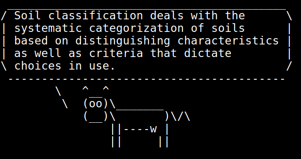

# wikicow.py

My first steps in to python programming. wikicow is a simple script that utilizes the pymediawiki module to pull a random article from Wikipedia, summarize it in to max 2 sentences and then pipe the summary in to cowsay in the terminal.

### What you need:

- Python
- pymediawiki module
- cowsay

The pymediawiki module can be installed with `pip install pymediawiki` and cowsay with `sudo apt-get install cowsay`  (on Ubuntu at least).

Then just run the script with `python wikicow.py` . Or make it exectuable and run it directly with `./wikicow.py` .

### Output:

### Issues:

There are some issues with the script, but for the most part it works as intended. Sometimes the script fails due to how the random part works, sometimes it pulls sites that are not just a simple article and it can't convert the output to a summary. Since this is just a script intended for my amusement and part of learning python, I need to come back to that and see how I can fix it.
